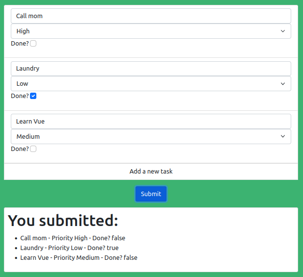

# Parent-child communication between Vue components

Find out about Vue.js' components and how to exchange information between them.

Vue.js is an open-source framework that can be used to build single-page applications and user interfaces. One of its main features is the creation of **components** that can be updated by the user and dynamically modify the page as preferred.

Today, I'm going to show you how I created a dynamic task list using Vue using two different components: a parent component representing the task list itself and all its information, and a child component representing a single task. I will also cover the communication between these two components in order to respond to user events.

Even though you don't need any previous Vue knowledge to follow the article, it is not intended to be an introduction to Vue as a framework, because some of its core features will not be visited here.

First of all, let's take a look at the webpage we are trying to build. It can be visited [here](https://vmtenorio.github.io/vue-task-list):



It is a simple webpage that contains a task list, each of them having a description, a priority and a checkbox to mark whether it is already done or not. It also contains a button to add new tasks and a button to submit the information, that just prints it out below.

<!--
You only need some basic knowledge of Javascript and I'll use some bootstrap classes to give it a fine look-and-feel, but they are not important for the construction of the Vue list.
-->


## Setting up the basics: Vue components

Components are Vue's reusable instances that form the data structure of the webpage. You can create a component specifying its properties, some data, methods or an HTML template. After it is created, you can use its name as an HTML tag anywhere in your page.

### The parent component: task-list

For example, let's define a simple component to represent our task list:

```javascript
Vue.component("task-list", {
    data () {
        return {
            tasks: [
                { id: 1, desc: "", priority: "Medium", done: false },
                { id: 2, desc: "", priority: "Medium", done: false },
            ]
        }
    },
    methods: {
        newTask() {
            this.tasks.push({
                id: this.tasks.length + 1,
                desc: "",
                priority: "Medium",
                done: false
            })
        },
        sendData () {
            // You could send your data via API
            // axios.post(TASK_API_URL, this.tasks)
            //     .then(function (response) {console.log(response);})
            var submittedList = document.getElementById("taskSubmitted");
            if (submittedList !== null) {
                submittedList.remove();
            }
            var responseContainer = document.getElementById("response");
            var taskListEl = document.createElement("ul");
            taskListEl.id = "taskSubmitted";
            responseContainer.appendChild(taskListEl);
            var newItem, itemStr;
            this.tasks.forEach(function (t) {
                newItem = document.createElement("li");
                itemStr = "";
                itemStr += t.desc;
                itemStr += " - Priority " + t.priority;
                itemStr += " - Done? " + t.done.toString();
                newItem.textContent = itemStr;
                taskListEl.appendChild(newItem);
            });
        }
    },
    template: listTemplate
});
```

Here, I'm creating a global component (can be used anywhere) called task-item, that contains some data (as a function, this is important), the methods to manipulate it and a template. The `data` function returns two placeholder tasks inside an array, and the `methods` are used to add new tasks (when clicking the "Add a new task" button in the page) and to submit the information introduced in the interface (in this case, it prints the submitted data inside the "You submitted" section of the webpage, but it could also send the data via API using a library like axios, as it can be seen in the comments).

Now that I have defined this component, I can use the `task-list` HTML tag anywhere in the document. Vue would then substitute this element by the contents of the `template` attribute, in this case the `listTemplate` variable, that contains:

```html
var listTemplate = `
    <div id="task-list" class="list-group w-50 mt-3 m-auto">
        <task-item
            v-for="t in tasks"
            :key="t.id"
            @update:desc="t.desc = $event"
            @change:done="t.done = $event"
            @change:priority="t.priority = $event"
        ></task-item>
        <div id="add-more">
            <button @click="newTask" type="button" class="text-center list-group-item list-group-item-action">Add a new task</button>
        </div>
        <div id="submit-button" class="my-3 w-100 text-center">
            <button type="button" class="btn btn-primary mx-auto" @click="sendData">Submit</button>
      </div>
    </div>
`;
```

We can see here the structure of the task list we saw earlier in the image of the webpage, as a Bootstrap list-group element (if you don't know Bootstrap, you just need to know that this element is used to easily define a pretty list of elements).

Let's focus first in the "Add a new task" and "Submit" buttons. Notice the `@click` HTML attribute? It is a short form of `v-on:click`, which defines a behaviour when a certain event occurs, in this case the `click` event. When clicked, they launch the methods defined earlier in the component.

We can also see an unknown HTML tag: `task-item`. It loops over the task list (contained in the `tasks` array, defined in the `data` function) with the `v-for` directive. It also contains several handlers for some events, that just update the value of the property of each task to the content of some variable `event`. As you may have already guessed, this `task-item` is another component, in this case a child component.

### The child component: task-item

The `task-item` component represents a single task in our task list. We can declare it as follows:

```javascript
Vue.component("task-item", {
    props: {
        id: Number,
        desc: String,
        priority: String,
        done: Boolean
    },
    template: taskTemplate
});
```

In this case the component is simpler, it just contains the template and the properties of the component: an identifier, the description of the task, its priority and whether it is already done or not.

Let's now analyze the contents of the template for the task item:

```html
var taskTemplate = `
    <div class="list-group-item">
        <input
            type="text"
            placeholder="Insert your task"
            @input="$emit('update:desc', $event.target.value)"
            class="form-control"
        />
        <select
            class="form-select"
            aria-label="Priority Selection"
            @change="$emit('change:priority', $event.target.value)"
        >
            <option disabled selected hidden>Priority</option>
            <option value="High">High</option>
            <option value="Medium">Medium</option>
            <option value="Low">Low</option>
        </select>
        <p><span>Done?</span>
        <input
            type="checkbox"
            @change="$emit('change:done', $event.target.checked)"
            class="form-check-input"
        />
        </p>
    </div>
`;
```

It contains the input of type text to introduce the description of the task, the selector to choose a priority and the checkbox to mark it as done. It also contain handlers to listen to `input` and `change` events. The only thing that may seem unclear is the `emit` directive on the handlers. This directive allows the task-item to communicate with its parent.

## Communication between parent and child components

Vue needs a way to bind a certain HTML element where the user is able to introduce data (such as an `input` or a `select` as we have used) to a certain property of our components. The most common way to do so is to use the `v-bind:attribute="prop"` directive (or its short form `:attribute="prop"`), which binds the value of the `attribute` of the HTML element where it is placed to the property defined in the data of the component.

For example, if we wanted to bind the `value` property of the first `input` HTML element to the `desc` property of our task-item, we just have to place `:value="desc"` in the `input` element. However, this updates the data of the object representing the component itself (i.e. the data attribute in the `task-item` component), and it would not change the contents of the data in the parent. This would be useful if we had declared the data inside the `task-item` component, but as we have done so in the parent, we must use the `emit` function to send the data upwards.

The `emit` function is used to trigger a custom event to the parent component, optionally with an argument. It receives two arguments: a name of the event to trigger and, optionally, any value. In this case, the first input element (the one of type text, controlling the description of the task) is emitting a `change:desc` event with the optional argument set to the text introduced by the user (`$event.target` refers to the input element itself, and the `value` of this element is the text it contains).

If you remember from earlier in the article, this event was captured in the task list (inside the task list template) and it setted the optional value received as argument (inside the `$event` variable) to the `desc` property of the item.

This parent-child communication allows you to declare and manipulate the data in the parent component, making it much easier to, for example, add new tasks to the page (simply pushing to an array) or sending the data via API.

---

Vue.js is a powerful library that allows you to respond to user input in an easy way. We have covered here the specifics of the communication between a hierarchy of components. This allows us to store the data in the most convenient way to manipulate it. 

Hope this post was useful for you. If you have any comments or suggestions, or you just want to let me know something, feel free to do so in the comments section of the post.


